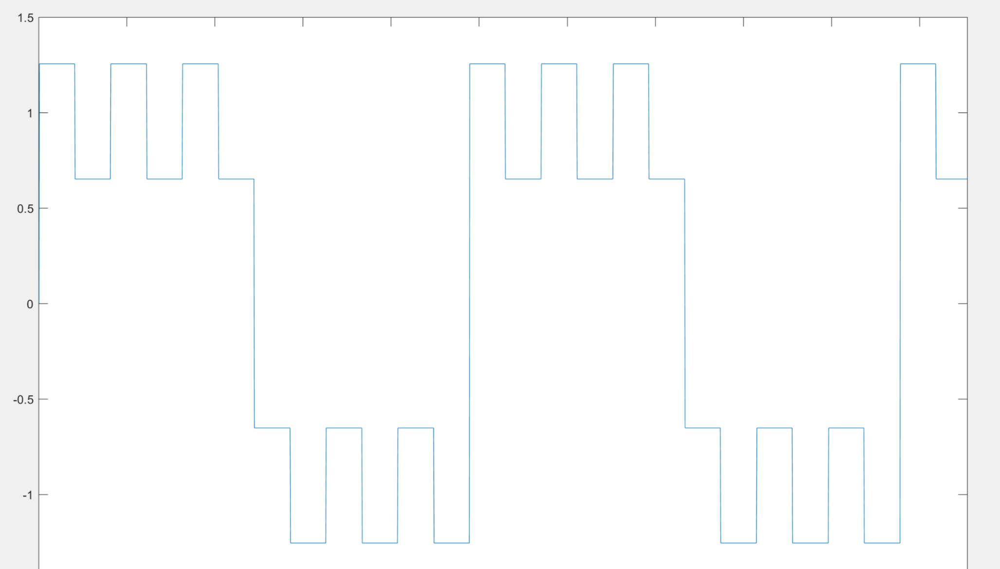

# Galileo
Galileo GNSS
### INTRODUCTION
Galileo GNSS (Global Navigation satellite system) is European Union navigation system.
In fact, in addition to widely used GPS (US GNSS),
other advanced countries have their own GNSS, for instance, Glonnas is Russia GNSS and BeiDou was created by China.
The purpose of this project is design and implementaion of Galileo E1-B Reciever in HDL-Coder. To do so, I designed a software which simulates
the Galileo I/NAV signal. This simulator generates Galileo messages with the help of RINEX files. Signal simulator was tested and verified with 
GNSS-SDR software, and I reached to about 2 meter accuracy. The reciever consist of three parts, that is, acquisition, track, and navigation. 
Acquisition and track parts are designed completely, the result is verified with the signal simulator, and although I am far behind the schedule,
I am planning to complete the third part
before April. Afterward, I will release the final version of the reciever in this page. 

### GALILEO RECEIVER 
Galileo receivers receive a summation of real signals from satellites and pseudorandom noise. In fact, the receiver must separate real signal from noise and then identify each satellite signal with the help of individual codes. These codes are called Ranging Code and they are individual for each satellite. Then, the receiver must determine Doppler effect and code delay. In fact, doppler effect should be removed from the signal with the help of a PLL. The distance between each two satellites can be determined by using delay time. Afterward, the reciever will be able to calculate the pseudoranges. Therefore, the receiver will be able to determine its position by means of at least 4 satellites positions and pseudoranges. More details are available in following parts. 

### 	GENERAL MESSAGE STRUCTURE
As illustrated in the figure, Galileo I/NAV Frame consists of 24 Sub-Frame, furthermore, each sub-frame is a collection of 15 pages.

I/NAV nominal page part is 250 bits with 10 bits’ synchronization pattern. Synchronization pattern is a constant number (0101100000). The receiver can achieve synchronization to the page boundary by means of the synchronization pattern. More information about message structure is accessible in Galileo ICD.

### 	E1 SIGNAL GENERATION
Generic view of E1 signal generation is depicted in this figure:  

eE1-B(t): multiplication of data stream, DE1-B(t), and E1-B ranging code, CE1-B(t).
 
eE1-C(t): Galileo E1-C ranging code (pilot component, this component is used for signal acquisition and it doesn’t carry data)
 
Furthermore, scx (t) = sgn(sin(2πRs,X)) where
 
Rs, E1-BOC (1,1) = 1.024 MHz 
 
Rs, E1-BOC (1,6) = 6.138 MHz
   
and, 
 
P= √(10/11)
   
Q= √(1/11)
   
  
Carrier function is depicted in this figure:

### RANGING CODE
Galileo Ranging codes are made by primary and secondary codes. E1-B and E1-C primary codes’ length are 4092 bits. E1-B secondary code is not applicable and the E1-C secondary code is 25 bits. In fact, ranging code is the multiplication of primary code and secondary code with respect to frequency. The E1-B and E1-C primary codes are pseudo-random memory code sequences.  And E1-C secondary code is 380AD90. (as previously mentioned, ranging codes are individual for each satellite.)
Ranging code generation is illustrated in this figure:

Before continuing this section, it is necessary to clarify some points. When the user turns on the receiver, the receiver starts to receive signal from satellites, it means that it is possible for the receiver to receive satellites signal from an unknown point (not from the beginning of the signal). As a result of that, the receiver must recognize ranging code start point (shift amount in receiving time) in order to acquis satellite. Furthermore, ranging code shift amount is necessary for data extraction from input signal. In order to solve this problem, ranging codes cross-correlation must satisfy below equation:
 
(C\*C)[n]< ϵ for n !=0  

 
In other words, ranging code cross-correlation must have a peek for n = 0 (or n = code length). This point is illustrated in this figure:

Note: I am trying to complete this article and release final version of my codes. If you have any question or problem, please do not hesitate to contact me.
